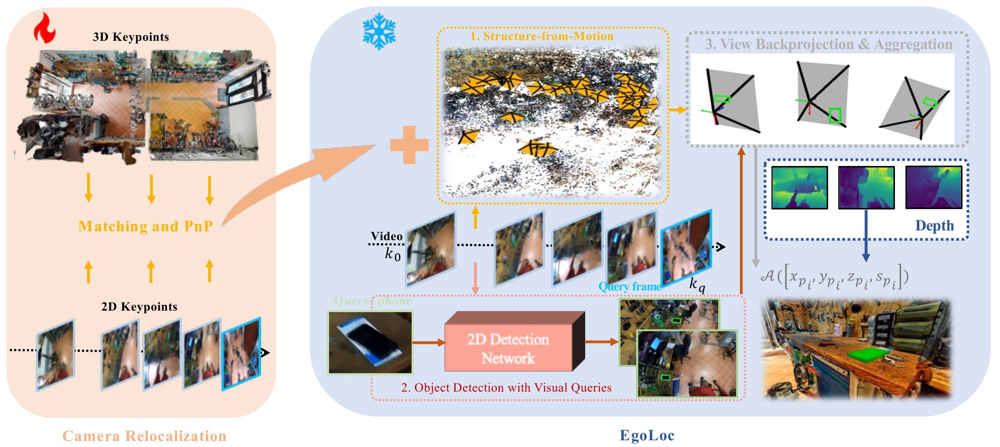

# Hybrid Structure-from-Motion and Camera Relocalization for Enhanced Egocentric Localization (CVPRW 2024)

*by [Jinjie Mai](https://scholar.google.com/citations?user=ksCEO0IAAAAJ&hl=en), 
[Abdullah Hamdi](https://abdullahamdi.com/),
[Silvio Giancola](https://www.silviogiancola.com/),
[Chen Zhao](https://zhao-chen.com/),
[Bernard Ghanem](https://www.bernardghanem.com/)*



*The implementation of 1st winner for VQ3D challenge in Ego4D Workshop at CVPR 2024.*


# RUN


This implementation (EgoLoc-V1) is an ensemble of previous methods, [EgoLoc](https://github.com/Wayne-Mai/EgoLoc) and [Ego4D baseline](https://github.com/EGO4D/episodic-memory/blob/main/VQ3D/README.md). Therefore, you need to prepare and reproduce both methods to reproduce our results.

## Start

Clone other repos we need:

```bash
git submodule update --init --recursive
```


## Preparation 1: EgoLoc

Kindly follow the document of [EgoLoc](https://github.com/Wayne-Mai/EgoLoc) to reproduce their results first.
Alternatively, you can use the precomputed camera pose from their shared Google drive instead: `all_val_test_pose.json`.


But you will still run the inference code to get the final test predictions.


## Preparation 2: Ego4D baseline


Kindly follow the step-by-step guide of [Ego4D baseline](https://github.com/EGO4D/episodic-memory/blob/main/VQ3D/README.md) to get camera pose.

Note since we are merging the camera poses from both methods, you will only need the intermediate camera pose file here:

```bash
# from Ego4D
python run_all_data.py
    --input_dir data/v1/clips_frames/ \
    --query_filename data/v1/annotations/vq3d_val.json \
    --camera_intrinsics_filename data/v1/scan_to_intrinsics.json \
    --scans_keypoints_dir data/v1/3d/scans_keypoints/ \
    --scans_dir data/v1/3d/scans/ \
    --output_dir data/v1/clips_camera_poses/ \

```

Above script will give you camera pose json file with the same format as what you get from EgoLoc. 


Additionally, we also provide our code snippets in `pnp_2d_3d.py` which only performs PnP. This script will give you `camera_poses_pnp.npy` file, which is from the PnP between 2D keypoints and 3D keypoints and contains the pose info we need. YOu may need to convert them into json format if you use our code snippets instead.


## Prediction

To do the final prediction, you need to merge the camera pose json files from both methods and do the final prediction.

Please check `merge_poses.py`:

```python

# Example usage
merge_json_files('all_val_test_pose.json', 
                 'baseline_camera_poses_pnp.json', 
                 'egoloc_pose_v1.json')
```

And then do the final prediction and submit it to the final server:


```bash
python ego_loc/run.py \
        --pose_dir data/precomputed/egoloc_pose_v1.json \
        --output_filename data/vq3d_results/egoloc_test.json \
        --vq2d_results 2d_retrieval/data/vq2d_test_vq3d_peak_clip.json \
        --mode test --experiment mf_weighted2d
```


## Citation

If you find this work useful, a citation will be appreciated via:
```
@inproceedings{mai2023egoloc,
  title={EgoLoc: Revisiting 3D Object Localization from Egocentric Videos with Visual Queries},
  author={Mai, Jinjie and Hamdi, Abdullah and Giancola, Silvio and Zhao, Chen and Ghanem, Bernard},
  booktitle={Proceedings of the IEEE/CVF International Conference on Computer Vision},
  pages={45--57},
  year={2023}
}
```


## Contact
I might not check the issues page on a daily bias, for instant questions or details about the paper,
feel free to email to: [jinjie.mai@kaust.edu.sa](mailto:jinjie.mai@kaust.edu.sa).

## Acknowledgment

Many thanks to [EgoLoc](https://github.com/Wayne-Mai/EgoLoc) and [Ego4D Episodic Memory Benchmark](https://github.com/EGO4D/episodic-memory/blob/main/VQ3D/README.md), from which we borrow some code. 

